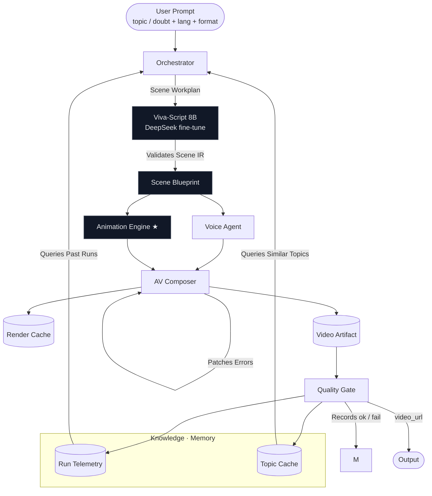

# Vivacity

```mermaid
flowchart TB
  U([User Prompt<br/>topic / doubt + lang + format])
  U --> O

  O[Orchestrator]

  O -->|"Scene Workplan"| S
  S[Viva-Script 8B<br/>DeepSeek fine-tune]
  S -->|"Validates Scene IR"| B
  B[Scene Blueprint]

  B --> V
  B --> A
  V[Voice Agent]
  A[Animation Engine ★]

  V --> C
  A --> C
  C[AV Composer]
  C -->|"Patches Errors"| C
  C --> R[(Render Cache)]
  C --> Out[(Video Artifact)]

  Out --> Q
  Q[Quality Gate]
  Q -->|"Records ok / fail"| M

  subgraph MEM["Knowledge · Memory"]
    M1[(Run Telemetry)]
    M2[(Topic Cache)]
  end

  Q --> M1
  Q --> M2
  M1 -->|"Queries Past Runs"| O
  M2 -->|"Queries Similar Topics"| O

  Q -->|video_url| X([Output])

  classDef own fill:#111827,stroke:#6b7280,color:#e5e7eb
  class S,A,B own
```

★ proprietary · not exposed
